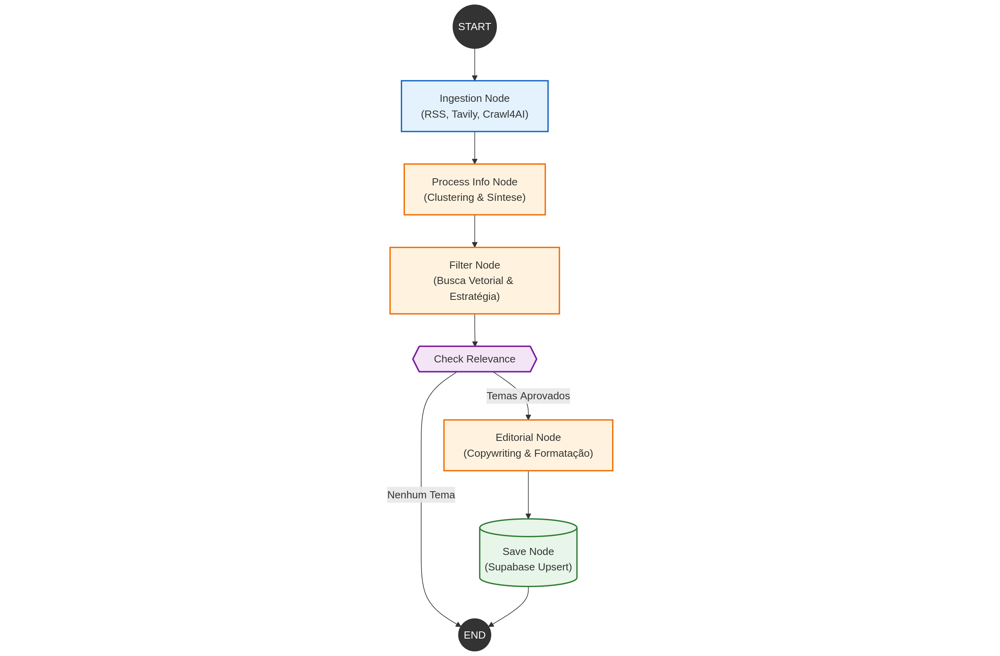

# Documentação Técnica do Projeto Crawl & Pautas Jurídicas - Predictus

Este documento fornece uma visão detalhada, técnica e estratégica da arquitetura da aplicação. O sistema foi projetado para operar como um pipeline de inteligência artificial que transforma dados brutos da web em ativos de marketing jurídico de alta conversão.

---

## Sessão 1: Frontend e Experiência do Usuário (Streamlit)

A interface do usuário foi construída utilizando **Streamlit**, priorizando agilidade e visualização de dados. O objetivo é permitir que o time de marketing visualize o histórico de pautas geradas e dispare novas execuções do crawler sob demanda.

### 1.1 Arquitetura da Interface (`streamlit_app.py`)

A aplicação opera em uma estrutura de **Single Page Application (SPA)** com navegação baseada em estado (`Session State`).

*   **Dashboards de Cards:** A tela inicial apresenta as pautas mais recentes em formato de cards visuais. Cada card exibe o título (manchete) e um "Hook" (gancho) curto, permitindo leitura rápida.
*   **Visualização Detalhada:** Ao clicar em um card, o usuário é levado a uma visão profunda da pauta, onde são expostos:
    *   **Metadados:** Veículo, Data, Categoria e Persona Alvo.
    *   **Contexto Híbrido:** O resumo dos fatos combinado com a análise de impacto jurídico.
    *   **Fontes:** Links diretos para as notícias originais que geraram aquele cluster.
    *   **JSON Raw:** Para desenvolvedores, há uma opção de expandir e ver o dado bruto gerado pelo backend.

### 1.2 Funcionalidades Críticas
1.  **Geração Assíncrona:** O botão "Gerar Novas Pautas" na sidebar invoca a função `run_pipeline()` do backend de forma assíncrona (`asyncio.run`). Isso garante que a UI não trave enquanto o crawler processa centenas de páginas.
2.  **Persistência em Arquivo:** O frontend não usa banco de dados SQL diretamente para leitura rápida na demo; ele lê arquivos JSON versionados na pasta `output/`, garantindo histórico imutável de cada execução.
3.  **State Management:** O uso de `st.session_state` controla a navegação entre Grid e Detalhes sem recarregar a página inteira, mantendo a fluidez.

---

## Sessão 2: Fluxo Lógico Backend (LangGraph)

O coração do sistema é um grafo de agentes orquestrado pelo **LangGraph**. A arquitetura segue um padrão linear com bifurcações condicionais para controle de qualidade.

### 2.1 Visão Geral do Grafo (`src/graph/workflow.py`)

O fluxo é definido por nós (funções de processamento) e arestas (transições). O estado global (`State` em `state.py`) trafega entre os nós, acumulando dados transformados a cada etapa.

**Pipeline Macro:**
`Ingestion` → `Process Info (Cluster)` → `Filter (Relevance)` → `Editorial (Copywriting)` → `Save`

### 2.2 Detalhamento dos Nós (Nodes)

#### 1. Ingestion Node (`ingestion_node.py`)
*   **Função:** Coletar dados brutos da internet e realizar o crawling inicial.
*   **Tecnologia:** Combina **Tavily Search API** (para buscas ativas de tendências) e **RSS Feeds** (para monitoramento passivo de portais jurídicos).
*   **Processamento - Crawling (Crawl4AI):** Nesta mesma etapa, as URLs identificadas são processadas, extraindo o conteúdo limpo e convertendo para Markdown.
*   **Lógica - Clusterização Semântica (`clustering.py`):**
    *   Gera **Embeddings** (vetores matemáticos) para cada notícia usando `text-embedding-3-small` da OpenAI.
    *   Aplica o algoritmo **Agglomerative Clustering** para agrupar notícias que falam sobre o mesmo assunto, baseado em distância de cosseno.
    *   *Diferencial:* Seleciona os "Documentos Representativos" de cada cluster (o que está mais perto do centro geométrico do cluster e os documentos mais densos/longos) para evitar ruído.
*   **Output:** Uma lista de clusters contendo documentos agrupados.

#### 2. Process Info Node (`process_info_node.py`)
*   **Função:** Transformar os clusters brutos em "Entidades de Tema".
*   **Lógica - Síntese com LLM:**
    *   Para cada cluster identificado na etapa anterior, o sistema aciona um agente (GPT-4o) para ler os documentos representativos.
    *   Gera um **Nome do Tópico** (Manchete), um **Resumo Consolidado** e uma **Justificativa Técnica** do agrupamento.
    *   Utiliza processamento paralelo (`asyncio.gather`) para resumir múltiplos clusters simultaneamente.

#### 3. Filter Node (`filter_node.py`)
*   **Função:** Curadoria estratégica (O "Product Manager" de IA).
*   **Lógica:** Compara os vetores (embeddings) dos clusters gerados com os embeddings dos **produtos da Predictus armazenados no Supabase**.
*   **Algoritmo:** Realiza uma busca de similaridade (Vector Search) para identificar se o tema da notícia tem conexão semântica forte com as soluções da empresa.
*   **Threshold:** Se a nota de relevância for menor que 70 (ou outro valor configurado), o tema é descartado. Isso impede que pautas genéricas ou irrelevantes cheguem ao time de marketing.

#### 4. Editorial Node (`editorial_node.py`)
*   **Função:** Redação final (O "Copywriter").
*   **Lógica:** Para os temas aprovados, este nó aciona um LLM especializado em copywriting jurídico (Persona definida em `prompts.py`).
*   **Output:** Gera o objeto `ContentBrief`, que contém:
    *   **Manchete (4 U's):** Urgente, Única, Útil, Ultra-específica.
    *   **Hook:** A frase inicial para prender a atenção.
    *   **Formato:** Determina se é melhor um Post de LinkedIn, Artigo de Blog ou Instagram, baseado na densidade do tema.
    *   **Bullets (PAS):** Estrutura Problema-Agitação-Solução.

#### 5. Save Node (`save_node.py`)
*   **Função:** Persistência.
*   **Lógica:** Salva os resultados estruturados em arquivos JSON na pasta `output/` e, opcionalmente, pode conectar com um banco de dados (Supabase) ou enviar para um webhook (n8n/Zapier) para distribuição.

### 2.3 Estruturas de Dados (`state.py`)
O sistema utiliza **Pydantic** para garantir tipagem forte e validação de dados em todo o fluxo. Os principais modelos são:
*   `DocumentObj`: O dado bruto da web.
*   `ThemeCluster`: O agrupamento semântico de notícias.
*   `ContentBrief`: O produto final (pauta de marketing).

---

## Conclusão

Este projeto não é apenas um "bot de notícias". É um **pipeline de inteligência de mercado** que automatiza as etapas de pesquisa, leitura, correlação e redação, entregando para o usuário final pautas altamente relevantes e customizadas para o caso de uso dos produtos da Predictus. A arquitetura modular permite fácil substituição de componentes (ex: trocar OpenAI por Anthropic ou Tavily por Google Search) sem quebrar o fluxo lógico.
