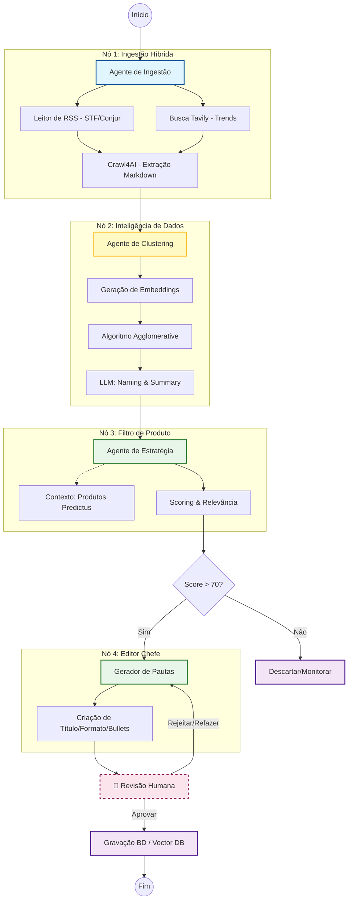

# Projeto_Crawler_Juridico

# Diagrama do fluxo de dados

Nesse nosso processo tenho 2 perguntas:

### Algoritmo de clusterização:
- Como posso saber se o algoritmo está performando bem ou não com os dados do mundo real?
- Quais são as métricas passíveis de mudança para aumentar a acuracidade  do modelo?

### Score de relevância do tema no contexto da Predictus
- Não haveria uma outra forma mais acurada de atribuir um score de relevância do que delegar isso à IA , mas sem que aumente muito o nível de dificuldade do projeto?
-  O score atribuido pela IA realmente é confiável?

